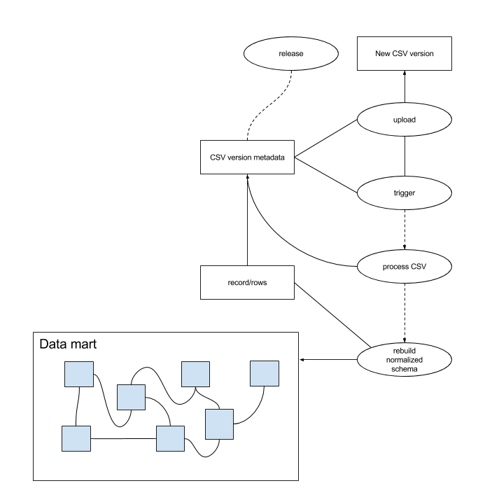

# System Context Model

## Components

### Benchmarking portal
This is the authenticated web UI which provides both the administrative capability to manage users and releases, and the agency dashboard view and drill-down functionality.

### Data mart
The data mart is rebuilt when new data is added to the system, and a release process is initiated.  This generation is comprised of several subproceses:

* CSV extraction
Uploaded CSV files are taken and stored as binary objects within a metadata table, where worker processes extracts each row into a master table, which mimics the CSV's flat-file structure.

* Update normalized tables
Once the final extraction worker has finished, a process can commence to start rebuilding the normalised datastructure in a blue/green setup to avoid disruption to current viewers of the system.

### Release semaphore
To ensure the release process can be done with zero downtime, the release semaphore ensures that only one is performed at a time, and that this is done with a blue/green data mart configuration.

### Router
The blue/green nature of the data mart requires a custom router which ensures requests are responded to with the stable backing service which is not being rebuilt for a new release.
