# Wireframes and Mockups

## Wireframes

### Homescreen
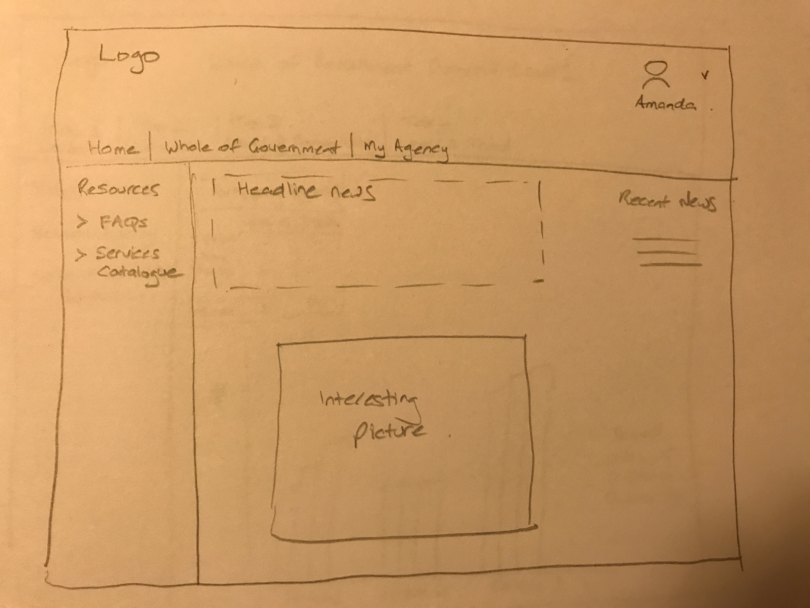

> Home screen. Left-hand pane links to useful document/information. News splash. Possibly links to previous news splashes. Rob wants it to look professional, authoritative. Dept Finance Logo should be top left of every screen, menu items across bottom of header on every screen and left-hand pane on every screen used for filters and navigation (see http://www.finance.gov.au/about-the-department/).

### Navigation
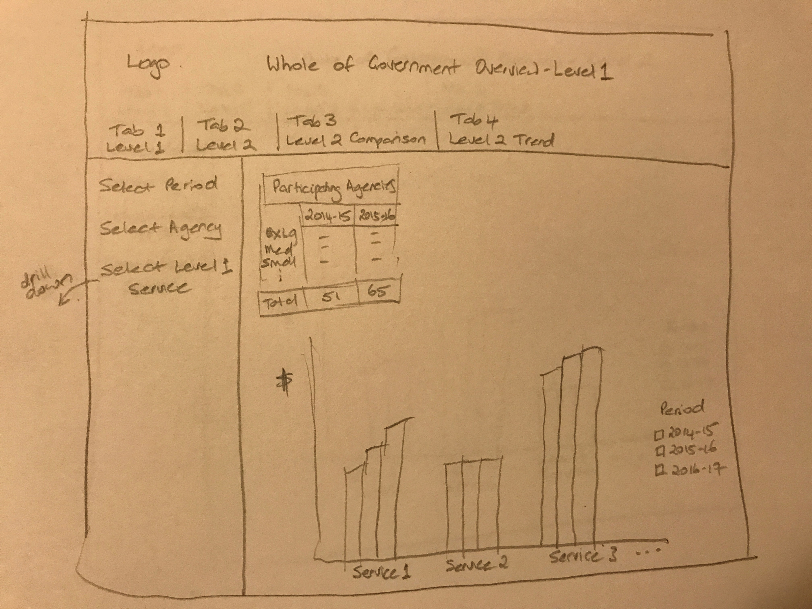

> [#61](https://github.com/gs-fin/benchmarking-portal/issues/61) Rob wants 'tabs across the top'. He might not want them actually called Tab 1, Tab 2, etc, but let's start with that. I think there should be a short description of what the tab is as well (probably instead of). This screen provides totals for Level 1 services (Financial, HR, Corporate, etc). It should include ERP, Major Projects, Non-Corporate and Pass Through. Rob said display them all. If they decide they don't want to display the 'other' level 1 services, they will take them out of the source data. Filters on the left are period (multi-select) and agency size (multi-select). By default, we should display the three periods of data we will have, but when they have 10 years, they will want to filter some out. By default it should display the total of all agencies. The user can select all agencies, or all medium/large/small/etc. The Participating Agencies table is OK as a table of numbers. No graph needed. We might include a total number of agencies that were invited to provide info (about 100, with 60 responding). 'Drill down' to the next screen by selecting a Level 1 service from the left-hand pane or from the graph.

### Drill down for level 1 service
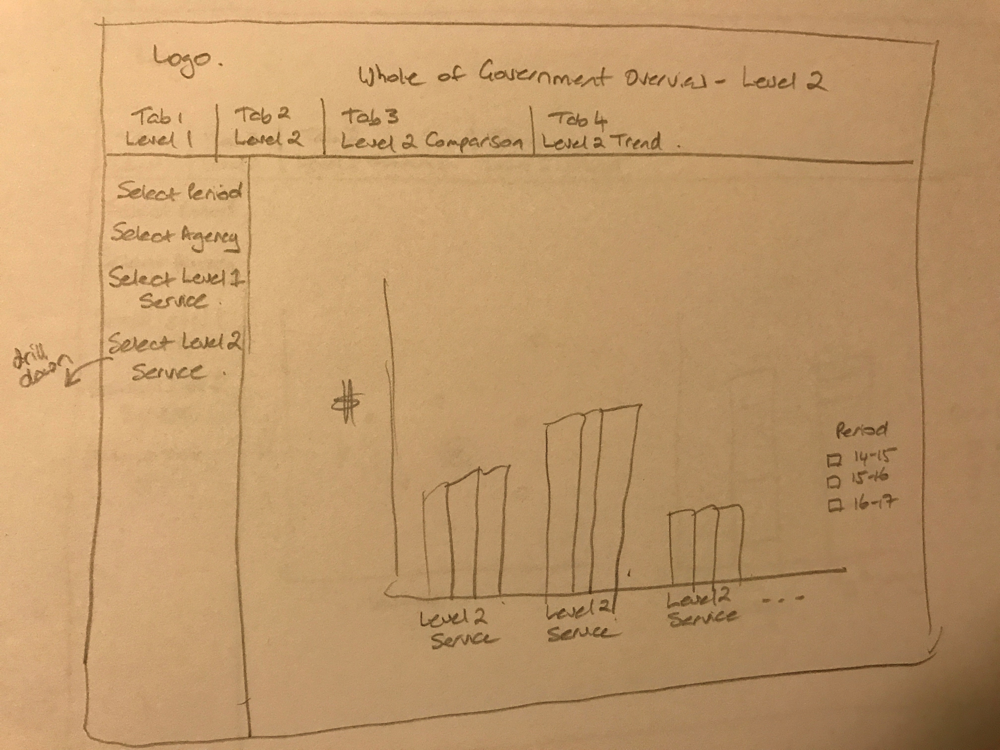

> [#63](https://github.com/gs-fin/benchmarking-portal/issues/63) (note [#62](https://github.com/gs-fin/benchmarking-portal/issues/62) is the same as [#61](https://github.com/gs-fin/benchmarking-portal/issues/61) but just for a selected agency or group of agencies). This is a drill-down for one Level 1 service. Figures are totals for each level 2 service for selected filters. Filters on the left-hand pane for multi-selection of period and agency size. Select Level 1 Service on the left-hand pane changes the graph to all level 2 services for a different Level 1 service. 'Drill down' to the next screen by selecting a Level 2 service on the left-hand pane or from the graph.

### Comparison of data and other filtered agency
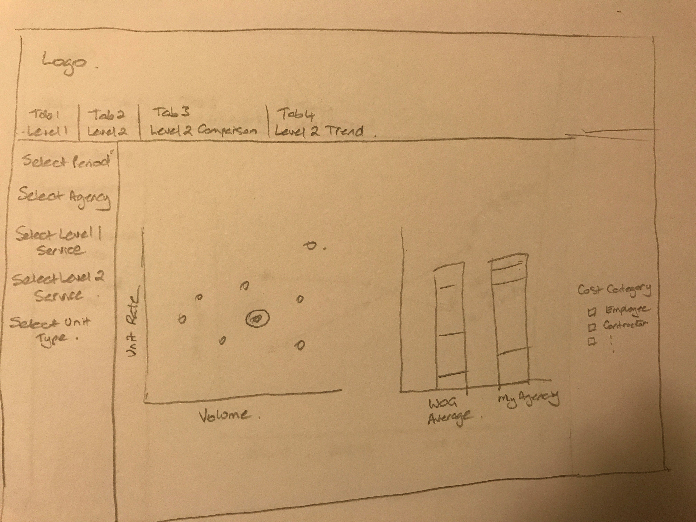

> [#64](https://github.com/gs-fin/benchmarking-portal/issues/64) This is a comparison of data between 'my agency' and the other selected agencies (selected by agency size). The scatter graph highlights my agency as a different coloured spot. Plotted points are unit rate x volume. The stacked bar graph compares my agency cost breakdown by category with the average cost breakdown by category for the selected agency sizes. These are total costs for the level 2 service. On the left-hand pane, the user can select period, multi-select agency sizes to compare against and the service by specifying levels 1 and 2. As there will be both a primary and secondary unit type for this year's data, the user will also have to select unit type (primary/secondary) - default to primary. Selecting Tab 4 from the top menu will take the user to the next screen.

### Cost trends for my agency and for the selected agency size
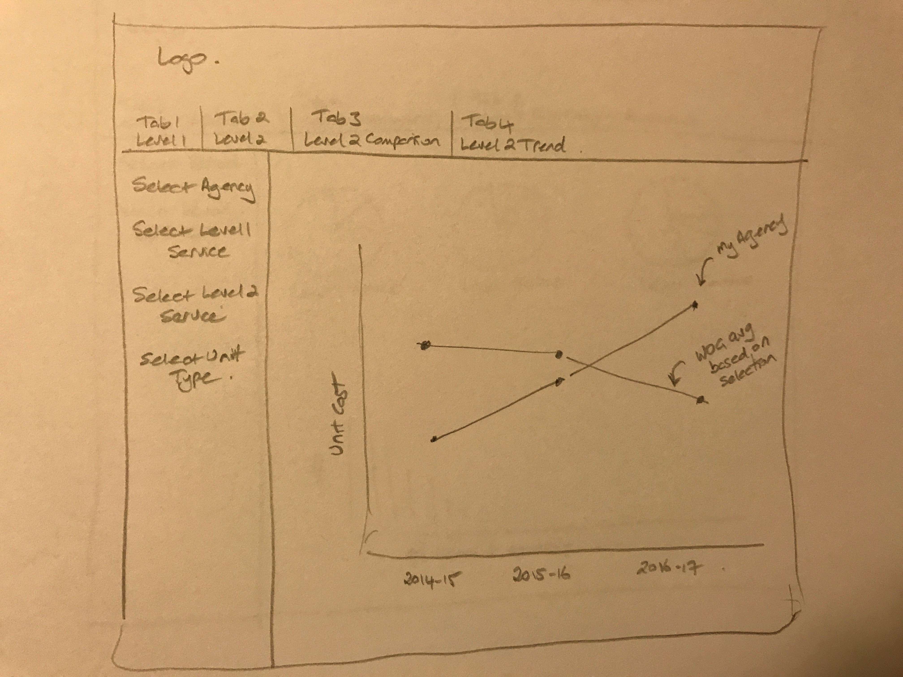

> [#65](https://github.com/gs-fin/benchmarking-portal/issues/65) This one has changed a bit from the ppt mockup. Rob doesn't want the trend lines split by agency. One line should show my agency unit cost for a level 2 service trending over time. The other shows the average unit cost for the same level 2 service for the selected agency sizes. Left-hand pane allows multi-select of agency size for comparison and selection of level1/level2 service. Unit type of primary or secondary will have to be selected.

**NOTE ON THE ABOVE**
The user can get to any of these screens by stepping down through the preceding screens or jumping straight there from the top menu. If they jump straight to a screen, they will need to select values for the filters. If they have stepped down, the filters should carry through from the previous screen (ie, if you have selected Financial Services and you drill down to display the level 2 services, the screen should know you want Financial Services as the level 1.

## Designs

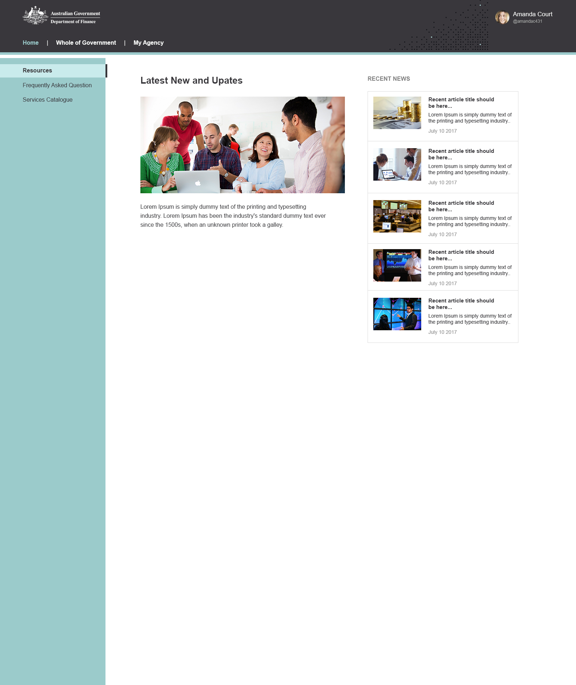

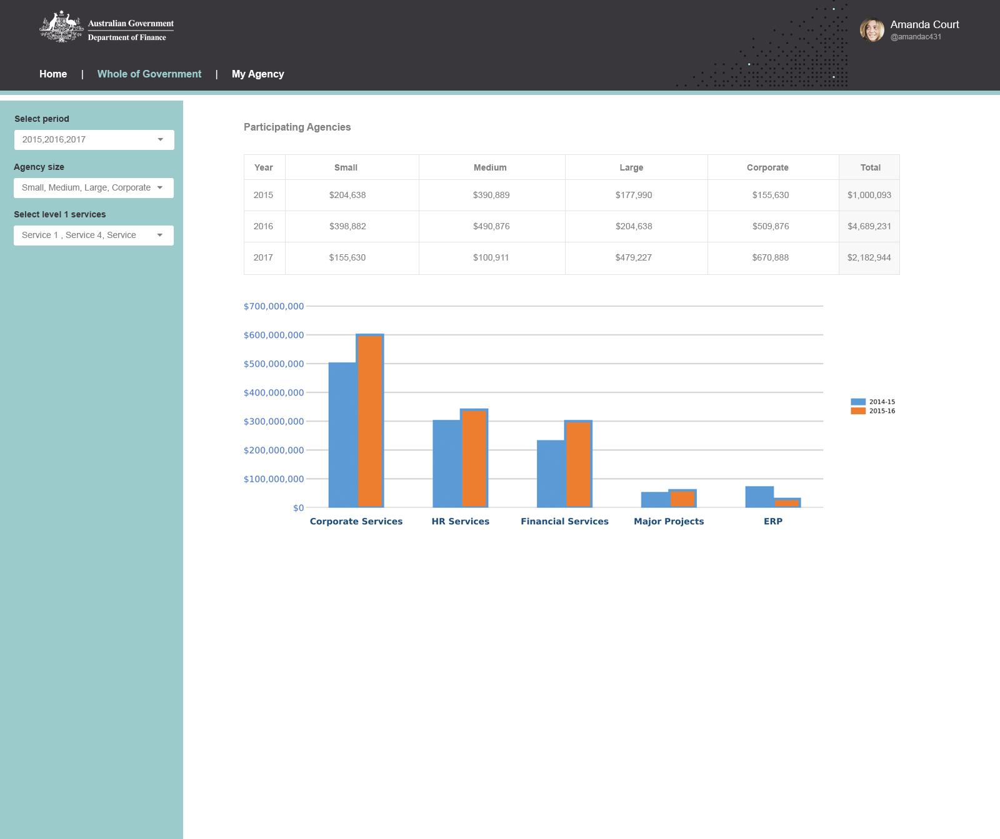

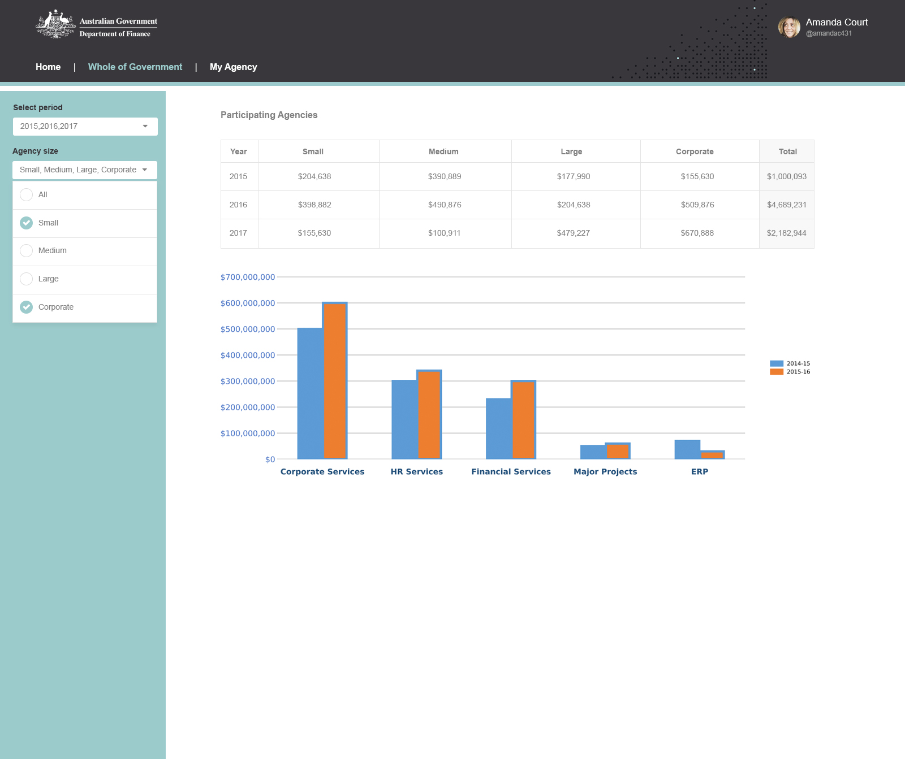

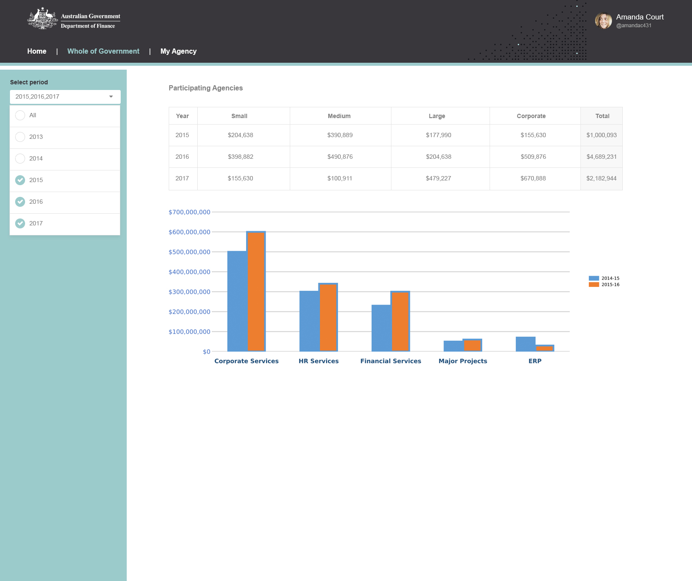

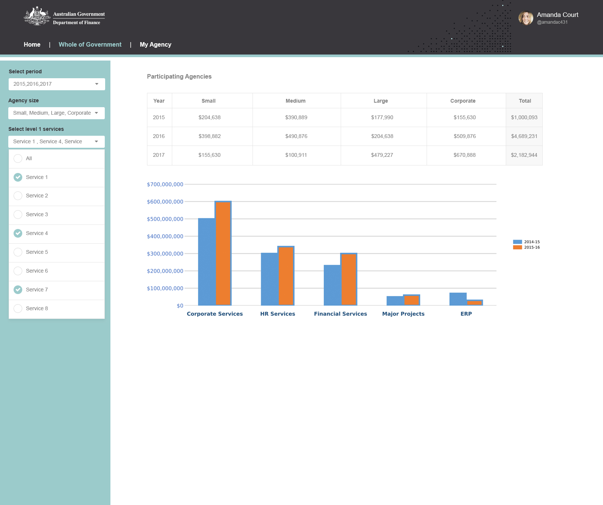

### Level 1 services

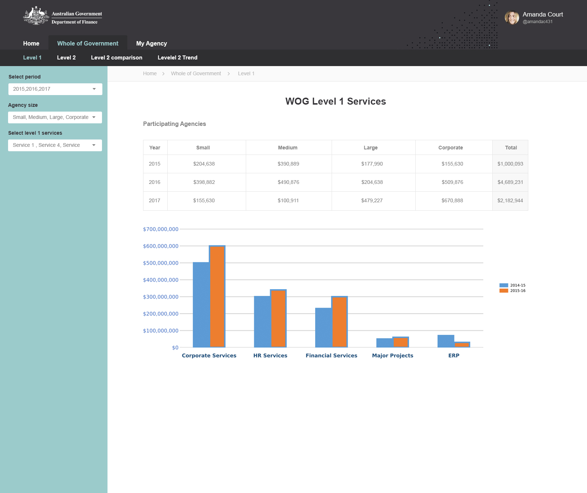

### Level 2 services

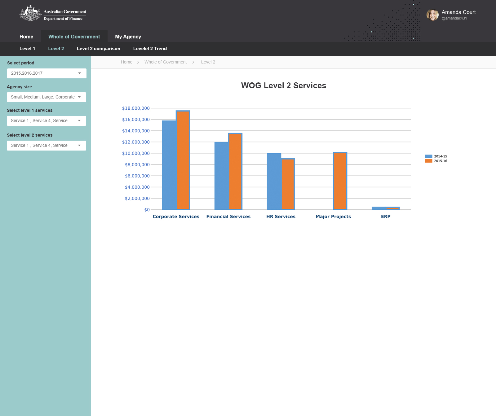

### Level 2 Benchmarking

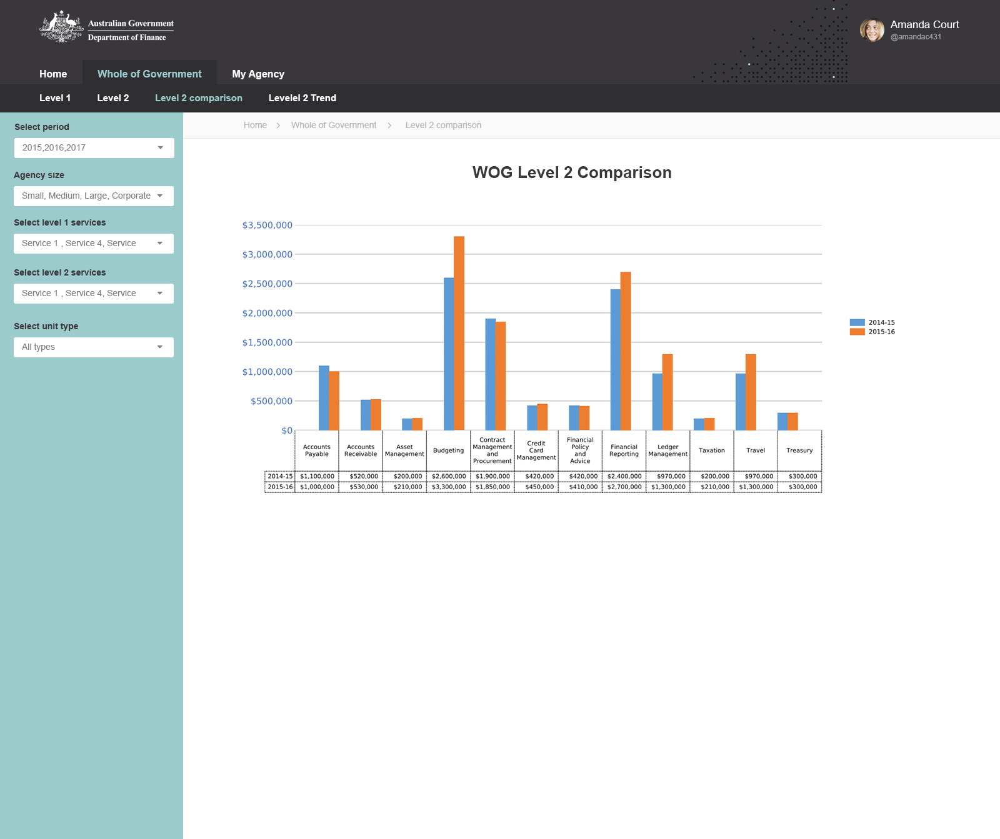
